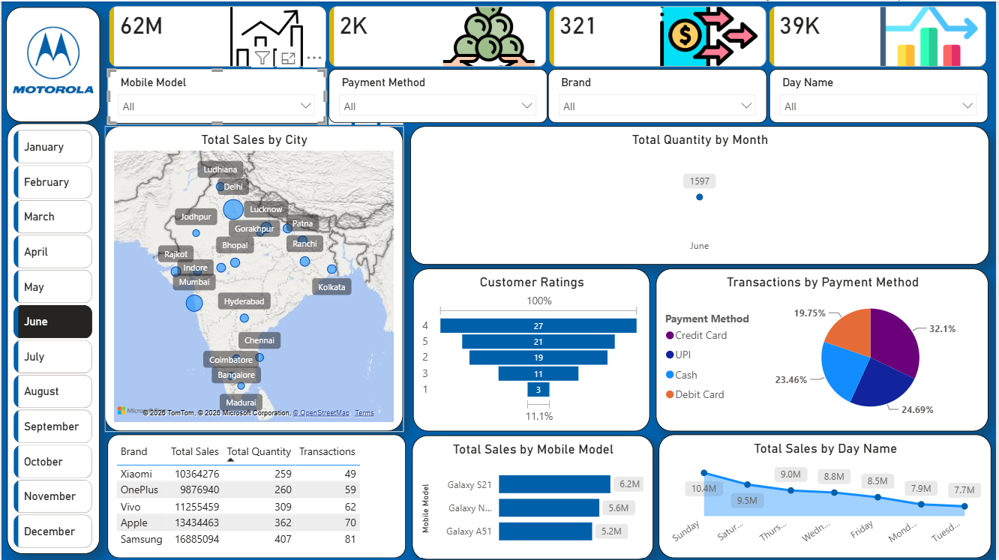

# 📊 Power BI Mobile Sales Dashboard

An interactive **Mobile Sales Dashboard** built in **Microsoft Power BI** using **Power Query, Data Modeling, DAX Measures, and Interactive Visualizations** to analyze mobile phone sales, customer behavior, payment methods, and overall business performance.

---

## 🚀 Project Overview

The **Power BI Mobile Sales Dashboard** provides a comprehensive view of mobile phone sales across different cities, brands, payment methods, and time periods. It enables users to monitor key performance indicators (KPIs), identify sales trends, analyze customer preferences, and make data-driven business decisions through an intuitive and interactive dashboard.

---

## ✨ Features

- 📈 Interactive Power BI Dashboard
- 💰 Total Sales Analysis
- 📦 Total Quantity Sold
- 🧾 Total Transactions
- 📊 Average Sales Value
- 📱 Mobile Model-wise Sales Analysis
- 🏷️ Brand-wise Performance
- 🗺️ City-wise Sales Visualization
- 📅 Monthly Sales Trend Analysis
- ⭐ Customer Ratings Distribution
- 💳 Payment Method Analysis
- 📆 Day-wise Sales Performance
- 🎯 Dynamic Slicers & Filters
- ⚡ KPI Cards for Business Insights

---

## 🛠️ Tools & Technologies Used

- Microsoft Power BI
- Power Query
- DAX (Data Analysis Expressions)
- Data Modeling
- Interactive Visualizations
- Slicers & Filters

---

## 📊 Dashboard Preview



---

## 📂 Repository Structure

```text
PowerBI-Mobile-Sales-Dashboard/
│
├── README.md
├── Mobile_Sales_Dashboard.pbix
├── Mobile_Sales_Dataset.xlsx
└── dashboard.png
```

---

## 📁 Dataset

The dataset contains **3,800+ mobile sales transactions** with the following attributes:

- Transaction ID
- Date (Day, Month, Year)
- Day Name
- Brand
- Mobile Model
- Quantity Sold
- Price Per Unit
- Total Sales
- Customer Name
- Customer Age
- Customer Ratings
- City
- Payment Method

---

## 📈 Key Performance Indicators (KPIs)

- 💰 Total Sales
- 📦 Total Quantity Sold
- 🧾 Total Transactions
- 📊 Average Sales Value

---

## 📊 Dashboard Insights

This dashboard helps users to:

- Analyze overall mobile sales performance.
- Compare sales across different cities.
- Identify top-performing mobile brands and models.
- Monitor monthly sales trends.
- Evaluate customer satisfaction through ratings.
- Analyze payment method preferences.
- Track sales performance by day of the week.
- Filter reports dynamically using:
  - 📱 Mobile Model
  - 💳 Payment Method
  - 🏷️ Brand
  - 📅 Month
  - 📆 Day Name

---

## ▶️ How to Use

1. Clone or download this repository.
2. Open **Mobile_Sales_Dashboard.pbix** using **Microsoft Power BI Desktop**.
3. If prompted, reconnect the dataset.
4. Refresh the data.
5. Explore the interactive dashboard using slicers and filters.

---

## 🎯 Business Benefits

- Monitor overall sales performance in real time.
- Identify top-selling products and brands.
- Understand customer purchasing behavior.
- Analyze geographical sales distribution.
- Improve business decision-making through interactive analytics.

---

## 👨‍💻 Author

**Takshil Kathiriya**  
🎓 IT Engineering Student

- 🔗 **GitHub:** https://github.com/TakshilKathiriya
- 🔗 **LinkedIn:** https://www.linkedin.com/in/takshil-kathiriya-17a367284/
- 📧 **Email:** takshilkathiriya2@gmail.com

---

⭐ If you found this project helpful, consider giving it a **Star**.
